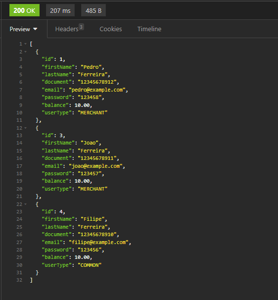
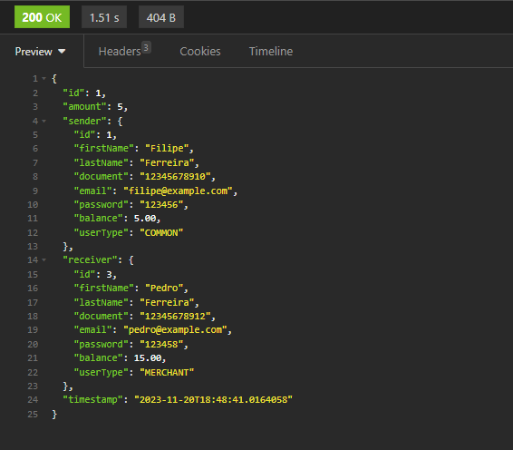
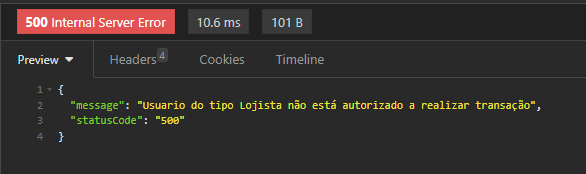
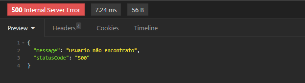

# picpayTest
Coding teste for picpay job

On this test I was able to use and explore more about DTOs and exceptions handler all that besides an simple architecture and h2 database only for tests

